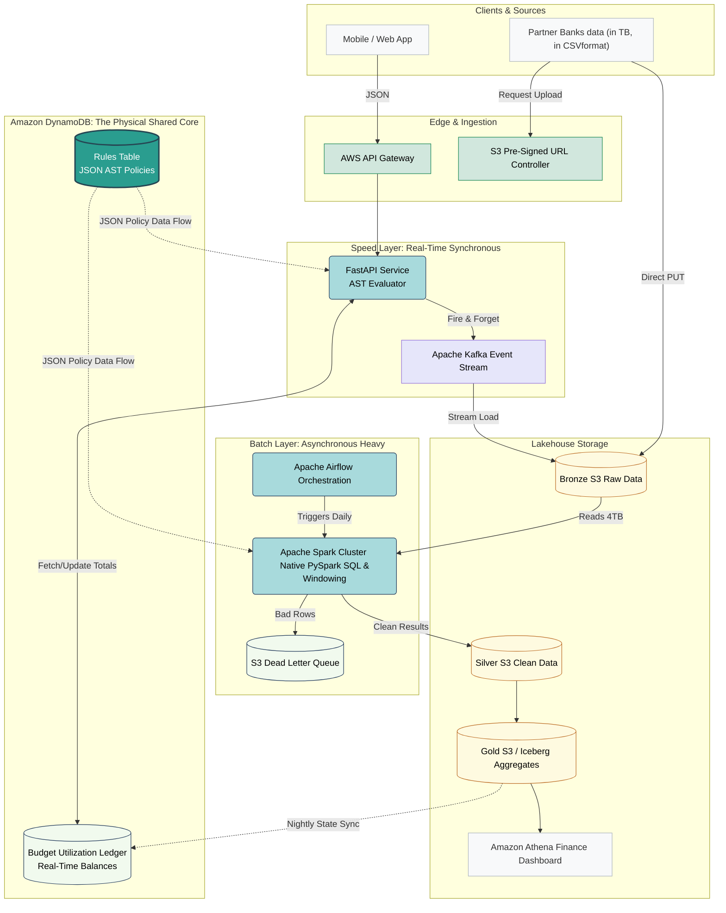
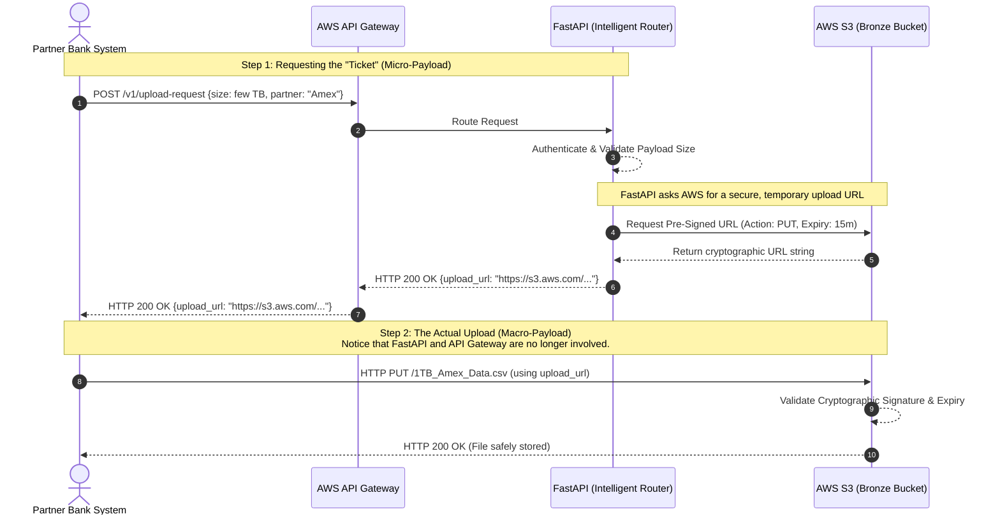
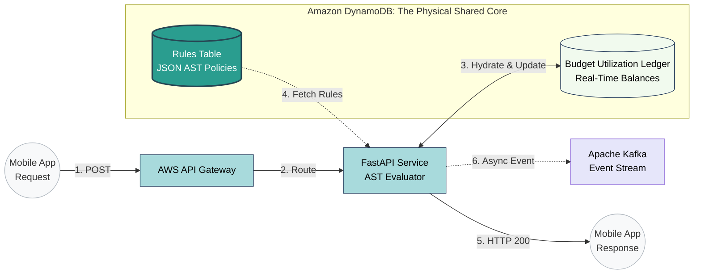
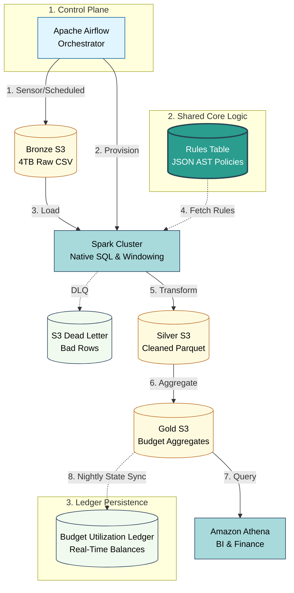

# Expense Policy Rules Engine - Visual Architecture Flows

This document contains detailed architectural diagrams for the Unified Platform.

## 1. The Master Data Map (Lambda Architecture)
This shows the macro-level split between the Speed Layer and the Batch Layer, unified by the Shared Core.

## 2: The Ingestion "Claim Check" Pattern.
This sequence diagram illustrates how we prevent 1TB+ partner files from crashing our synchronous web servers.

## 3: The Speed Layer (Real-Time)
This component flow proves how we meet the strict < 20ms latency SLA for mobile app users. Notice how the Kafka publish is safely outside the user's waiting path.

## 4. The Batch Layer (Data Lakehouse ETL)
This diagram shows the asynchronous orchestration of massive historical data through the Medallion architecture (Bronze, Silver, Gold).

