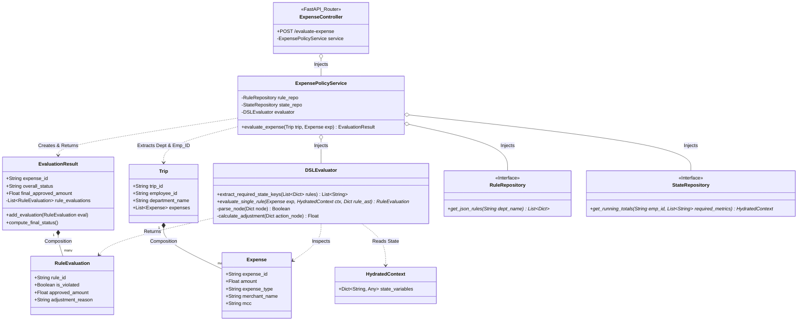

# Low-Level Design (LLD): FastAPI Speed Layer (Config-Driven)

---

## 1. Architectural Philosophy
This Low-Level Design follows **Clean Architecture** combined with a **Config-Driven (DSL) Model**. To achieve "Zero Logic Drift" with the Spark Batch Layer, the FastAPI engine does not contain hardcoded business rules (no Python `if/else` policy logic). Instead, it acts as a lightweight, lightning-fast execution environment that parses and evaluates the exact same JSON Abstract Syntax Trees (AST) used by the data lake.

### Logical Directory Structure
* **`app/api/`**: The "Web" Layer. FastAPI routers and Pydantic DTOs for sub-20ms request validation.
* **`app/domain/`**: The "Core" Layer. Contains the Domain Entities and the DSL parsing logic.
* **`app/services/`**: The "Orchestration" Layer. Coordinates data fetching (rules + state) before execution.
* **`app/infrastructure/`**: The "Implementation" Layer. DynamoDB queries for fetching JSON rules and real-time running balances.

---

## 2. Domain Entities (The "Financial State")
* **`Expense`**: Represents a single incoming line-item.
* **`Trip`**: Represents the current report context.
* **`HydratedContext`**: A dynamic dictionary/object containing the live external data required by the DSL (e.g., `running_daily_meal_total`).
* **`RuleEvaluation`**: The mathematical outcome of the applied rule (`original_amount`, `approved_amount`, `excess_amount`).
* **`EvaluationResult`**: The final payload returned to the mobile app or UI.

---

## 3. Core Design Patterns

### A. The AST Evaluator Pattern (Replaces Strategy Pattern)
We abandon the Strategy Pattern (inheritance of rule classes) in favor of an **Abstract Syntax Tree Evaluator**. 
* **`DSLEvaluator`**: A recursive Python class that reads a JSON rule block, resolves the operators (`AND`, `OR`, `>`, `==`), and applies the math to the combined `Expense` + `HydratedContext`.

### B. The Hydration/State Pattern
Because FastAPI processes one transaction at a time, it cannot use "Window Functions" like Spark to know the running totals. 
* Before the engine runs, the Service layer must query the **`StateRepository`** (DynamoDB) to fetch the employee's current real-time balances (e.g., "Amount spent on meals today prior to this swipe").

### C. The Repository Pattern
* **`RuleRepository`**: Fetches the active JSON rule definitions from DynamoDB based on `department_id`.
* **`StateRepository`**: Fetches real-time aggregations.

---

## 4. The Execution Flow (The Service Layer)
The `ExpensePolicyService` orchestrates the sub-20ms flow:

1.  **Request Reception**: API receives an `Expense` payload.
2.  **Rule Retrieval**: Service calls `RuleRepository` to get the JSON ASTs.
3.  **State Hydration**: Service reads the JSON rules to see what state is needed (e.g., "Need 30-day rolling total"), then calls `StateRepository` to fetch exactly those values.
4.  **Execution**: Passes the `Expense`, `HydratedContext`, and `JSON Rules` into the `DSLEvaluator`.
5.  **Response**: Returns the `EvaluationResult` to the frontend indicating instant approval or adjustments.

---

## 5. UML Class Diagram: Config-Driven API

## 6. DynamoDB Data Model (Persistence Layer)

### Architectural Context: The Lambda Architecture Sync
To support sub-20ms real-time API evaluations while guaranteeing 100% financial accuracy, the system employs a Lambda Architecture. 
* **FastAPI (Speed Layer):** Reads and increments balances instantly during manual card swipes.
* **Spark (Batch Layer):** Acts as the Ultimate Source of Truth, processing massive corporate card files and performing a "Reverse ETL" sync at 3:00 AM to forcefully overwrite and correct the DynamoDB running totals.

The DynamoDB schemas are heavily optimized to support lightning-fast single-item reads (FastAPI) while absorbing massive parallel write spikes (Spark) without suffering from "Hot Partitions."

---

### Table 1: State Repository (`ExpenseEngine-State`)
**Purpose:** Stores the real-time financial running totals and limits for every employee.

**Access Patterns:**
1. **FastAPI Read:** Fetch all active balance metrics for a specific employee instantly.
2. **FastAPI Write:** Increment an employee's specific balance atomically upon expense approval.
3. **Spark Batch Write:** Mass-overwrite balances for all employees simultaneously without throttling.

**Schema Design:**
By using `employee_id` as the Partition Key (PK), the 3:00 AM Spark sync distributes its write load evenly across hundreds of physical AWS servers, completely eliminating write bottlenecks.

| Partition Key (PK) | Sort Key (SK) | Attribute: `current_balance` | Attribute: `ttl_timestamp` |
| :--- | :--- | :--- | :--- |
| `EMP#101` | `BUDGET#MEAL_DAILY#2026-04-03` | `150.00` | `1712275200` |
| `EMP#101` | `BUDGET#FLIGHT_MONTHLY#2026-04` | `450.00` | `1714521600` |
| `EMP#102` | `BUDGET#MEAL_DAILY#2026-04-03` | `45.00` | `1712275200` |

**Design Notes:**
* **Atomic Counters:** FastAPI uses DynamoDB `UpdateItem` with the `ADD` operation. It does not perform a Read-Modify-Write cycle, completely avoiding race conditions if an employee submits two expenses at the exact same millisecond.
* **Cost Optimization (TTL):** The `ttl_timestamp` instructs DynamoDB to automatically delete expired historical limits (e.g., yesterday's daily cap) in the background for free, preventing infinitely growing storage costs.

---

### Table 2: Rule Repository (`ExpenseEngine-Rules`)
**Purpose:** Stores the JSON Abstract Syntax Tree (AST) representations of the business policies.

**Access Patterns:**
1. **FastAPI / Spark Read:** Fetch all active JSON rule trees for a specific department.

**Schema Design:**
The `department_name` acts as the Partition Key to group an entire policy suite into a single network fetch.

| Partition Key (PK) | Sort Key (SK) | Attribute: `rule_ast` (JSON) | Attribute: `is_active` |
| :--- | :--- | :--- | :--- |
| `DEPT#SALES` | `RULE#R-101` | `{"action": "CAP", "condition": ...}` | `true` |
| `DEPT#SALES` | `RULE#R-102` | `{"action": "REJECT", "condition": ...}`| `true` |
| `DEPT#ENGINEERING` | `RULE#R-101` | `{"action": "CAP", "condition": ...}` | `true` |

**Design Notes:**
* **In-Memory Caching (Mitigating Read Spikes):** Because thousands of employees in "Sales" could trigger reads to the `DEPT#SALES` partition simultaneously, the API's `RuleRepository` implements an in-memory cache (e.g., a 5-minute TTL). FastAPI fetches the JSON from DynamoDB once and evaluates subsequent requests entirely in RAM, bringing database read costs down to near-zero.